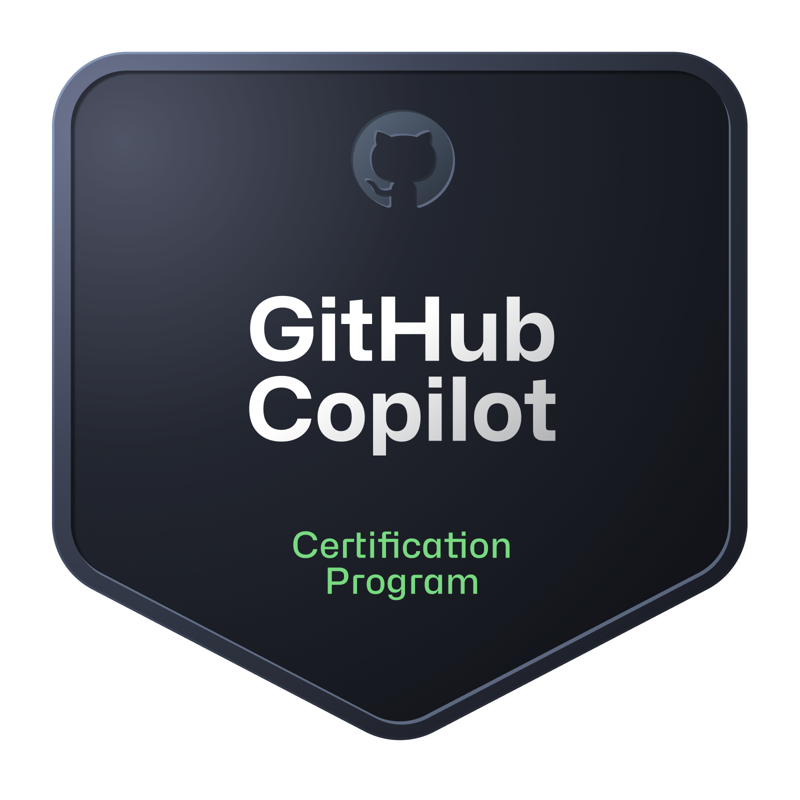

> [🇧🇷 Português](../README.md) | **🇬🇧 English** | [🇪🇦 Español](./README_Spanish.md)

 
         
        
        

- Currently I'm working as **Junior Fullstack developer** at **[Visionnaire](https://www.visionnaire.com.br/)**

- 🌱 I'm studying **Cloud Computing**

- 👨‍💻 My projects are available at [Repositories](https://github.com/Salgado2004?tab=repositories)

- 📫 To contact me **leonardo.fsalgado04@gmail.com**

- 📄 To know more about me [Leonardo Felipe Salgado](https://www.linkedin.com/in/leonardo-felipe-salgado-394312234?lipi=urn%3Ali%3Apage%3Ad_flagship3_profile_view_base_contact_details%3B%2FCJ414PWQEupkRlQvWYlWA%3D%3D)

- ⚡ Fun fact **I also enjoy working with 3D modeling and animation 😅**

<h2 align="left">Certifications: </h2>

  
  
  
  
  
  
  
  
  

<h2 align="left">Languages and Tools:</h2>

