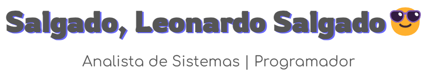

> [Versão em português 🇧🇷](../README.md) | **English version 🇬🇧** | [Versión en español 🇪🇦](README_Spanish.md)

    
    
    

## About me

- I am currently working as a **Junior Systems Analyst** at **Banco Bradesco**
- I am studying **Cloud Computing** 🌱
- Check out [my repository tab](https://github.com/Salgado2004?tab=repositories) to see my projects 👨‍💻
- Contact me at email leonardo.fsalgado04@gmail.com 📫
- Visit [my LinkedIn profile](https://www.linkedin.com/in/leonardo-felipe-salgado-394312234) to learn more about me 📄
- Fun fact: I enjoy 3D animation and Formula 1 🏎️

## Languages and Tools:

## Certifications:

- [AZ-900 - Azure Fundamentals](https://learn.microsoft.com/api/credentials/share/pt-br/LeonardoFelipeSalgado-9348/5980314B113D89D7?sharingId=D086D9D18823ED2F)
- [DP-900 - Azure Data Fundamentals](https://learn.microsoft.com/api/credentials/share/pt-br/LeonardoFelipeSalgado-9348/9C0532419F5B8D95?sharingId=D086D9D18823ED2F) 
- [SC-900 - Security, Compliance and Identity Fundamentals](https://learn.microsoft.com/api/credentials/share/pt-br/LeonardoFelipeSalgado-9348/D749299B2C75B6E5?sharingId=D086D9D18823ED2F)
- [AI-900 - Azure AI Fundamentals](https://learn.microsoft.com/api/credentials/share/pt-br/LeonardoFelipeSalgado-9348/59B23AA371CF84CA?sharingId=D086D9D18823ED2F)
- [AZ-204 - Azure Developer Associate](https://learn.microsoft.com/api/credentials/share/pt-br/LeonardoFelipeSalgado-9348/BB657823B318AE17?sharingId=D086D9D18823ED2F)
- [GitHub Foundations Certification](https://www.credly.com/badges/0c6c8fa2-db7c-459b-b46a-0f9128699649/public_url)
- [GitHub Advanced Security Certification](https://www.credly.com/badges/4b497a3f-b69f-4e49-9154-dcdd654d6a8c/public_url)
- [GitHub Copilot Certification](https://www.credly.com/badges/47e74326-b519-40bd-ac54-a15e75157b6b/public_url)
- [AWS Certified Cloud Practitioner](https://www.credly.com/badges/2d628f4f-004b-490f-a7bc-63dc4c964c6e/public_url)